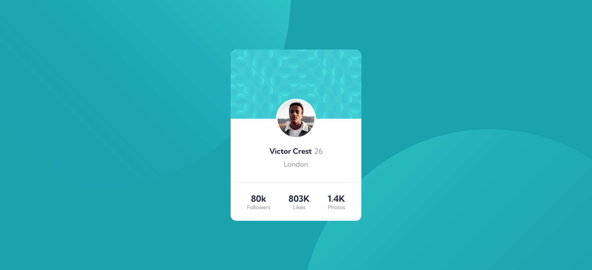

# Frontend Mentor - Profile card component solution

This is a solution to the [Profile card component challenge on Frontend Mentor](https://www.frontendmentor.io/challenges/profile-card-component-cfArpWshJ). Frontend Mentor challenges help you improve your coding skills by building realistic projects.

## Table of contents

- [Overview](#overview)
  - [The challenge](#the-challenge)
  - [Screenshot](#screenshot)
  - [Links](#links)
- [My process](#my-process)
  - [Built with](#built-with)
  - [What I learned](#what-i-learned)
- [Author](#author)

## Overview

Challenge was to build out this profile card component and get it looking as close to the design as possible.

### The challenge

- Build out the project to the designs provided

### Screenshot



### Links

- Solution URL: https://github.com/Gunner40/Profile-card-component
- Live Site URL: https://gunner40.github.io/Profile-card-component/

## My process

1: Looked through the designs and planned out how you'll tackle the project. This step is crucial to help think ahead for CSS classes to create reusable styles.
2: Wrote the HTML
3: Wrote the CSS
4: Created a repository on github and added the files
5: Deployed the project live on the internet using github hosting
6: Uploaded my solution to frontend mentor

### Built with

- Semantic HTML5 markup
- CSS custom properties
- Flexbox
- Mobile-first workflow

### What I learned

I learned that it is possible to use multiple background images on the same element, and that it is possible to move them around and position them wherever I want using the background-position property. The first url in the background-image property is closest to the viewer.

```css
background-image: url("./images/bg-pattern-top.svg"),
  url("./images/bg-pattern-bottom.svg");
background-repeat: no-repeat;
background-position: right 50vw bottom 50vh, left 50vw top 50vh;
```

## Author

- Name - Paul Ryan
- Frontend Mentor - [@Gunner40](https://www.frontendmentor.io/profile/Gunner40)
